# WAF Analysis: ModSecurity on a Vulnerable Web Application (DVWA)

> **Type:** Web Application Firewall (WAF) Analysis and Attack Logging
> **Environment:** Virtualized (Kali Linux + Docker: WAF ModSecurity, DVWA, Dozzle)
> **Date:** September 2025
> **Author:** Évora da Ibéria Leite · [evoraleite@gmail.com](mailto:evoraleite@gmail.com)
> **Tools:** Nmap · ModSecurity · DVWA · Dozzle

---

## Table of Contents

- [Executive Summary](#executive-summary)
- [Objective](#objective)
- [Scope](#scope)
- [Methodology](#methodology)
- [Lab Architecture](#lab-architecture)
- [Reconnaissance](#reconnaissance)
- [Attacks in Detection Mode (DetectionOnly)](#attacks-in-detection-mode-detectiononly)
  - [SQL Injection](#sql-injection-detection-mode)
  - [XSS DOM](#xss-dom-detection-mode)
  - [Command Injection](#command-injection-detection-mode)
- [Attacks in Blocking Mode (On)](#attacks-in-blocking-mode-on)
  - [SQL Injection](#sql-injection-blocking-mode)
  - [XSS DOM](#xss-dom-blocking-mode)
  - [Command Injection](#command-injection-blocking-mode)
- [NIST IR Framework](#nist-ir-framework)
- [Recommendations](#recommendations)
- [80/20 Action Plan](#8020-action-plan)
- [Conclusion](#conclusion)

---

## Executive Summary

The environment used is a virtual lab with two main components: a vulnerable web application (DVWA) and a WAF (ModSecurity) sitting in front of it.

DVWA is a deliberately vulnerable web application used for security training. For this project, only the **low security** level was used.

The WAF can be configured in two modes:

- **DetectionOnly:** logs attacks without blocking them
- **On:** actively blocks attacks and returns 403 Forbidden

In detection mode, all attacks against the application succeeded. Logs confirmed the attacks with detailed tagging and classification. In blocking mode, all three attack types were immediately blocked with no changes required in the application backend.

The conclusion: even a critically vulnerable application with no backend controls can benefit significantly from a properly configured WAF. However, the WAF should be treated as a second line of defense, not a substitute for fixing the application itself.

---

## Objective

Analyze the logs of a WAF configured in front of a vulnerable web application, and observe the difference in behavior between detection-only and active blocking modes.

---

## Scope

Virtualized environment running Kali Linux with Docker, simulating four machines:

| Container | IP | Role |
|-----------|-----|------|
| WAF ModSecurity | 192.168.35.30 | Firewall (DetectionOnly or On) |
| DVWA | 192.168.35.40 | Target web application |
| Dozzle | 192.168.35.50 | Log viewer |
| Kali Linux | 192.168.35.11 | Attacker machine |

---

## Methodology

After starting the Docker environment, an Nmap scan was run against the WAF container to confirm open ports:

```bash
nmap -sS -sV waf_modsec
```

DVWA was configured by logging in, resetting the database, and setting the security level to **low**.

The WAF mode was changed by editing `MODSEC_RULE_ENGINE` in the `docker-compose.yml` file:

```
MODSEC_RULE_ENGINE = DetectionOnly   # logs only
MODSEC_RULE_ENGINE = On              # blocks attacks
```

All attacks were performed directly against the application at `localhost:8080`. For each mode, three attack types were tested: SQLi, XSS DOM, and Command Injection. Logs were reviewed in Dozzle after each attack.

---

## Lab Architecture

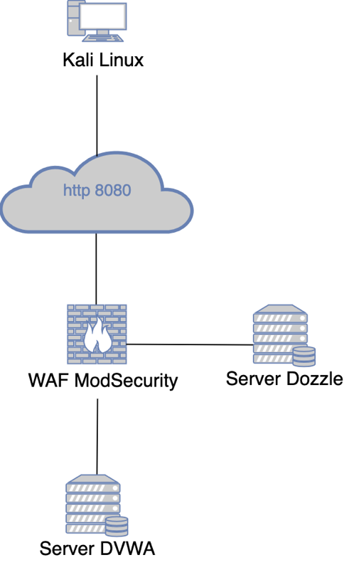

Traffic flow: Kali Linux sends HTTP requests on port 8080. The WAF ModSecurity intercepts all traffic before it reaches the DVWA server. Dozzle streams all container logs in real time.

---

## Reconnaissance

An Nmap scan confirmed the WAF is listening on ports 8080 (HTTP) and 8443 (HTTPS):

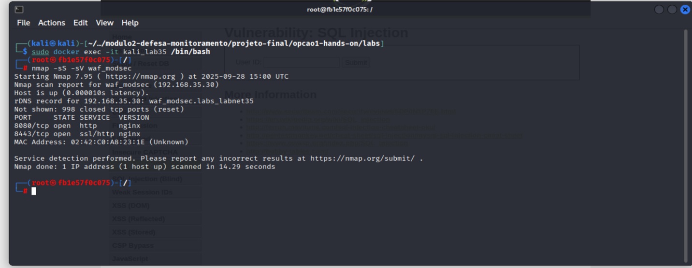

---

## Attacks in Detection Mode (DetectionOnly)

In this mode, the WAF logs all attacks but does not interfere with traffic. All three attacks succeed and return real data to the attacker.

---

### SQL Injection (Detection Mode)

**Attack payload injected in the User ID field:**

```
1' OR '1'='1
```

The attack succeeds. The application returns all user records from the database:

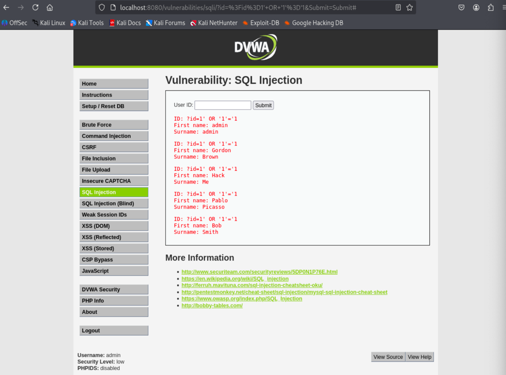

The Dozzle log confirms the detection with the exact payload and classification tags:

```
tags=["attack-sqli", "OWASP_CRS", "paranoia-level/1"]
message="SQL Injection Attack Detected via libinjection"
```

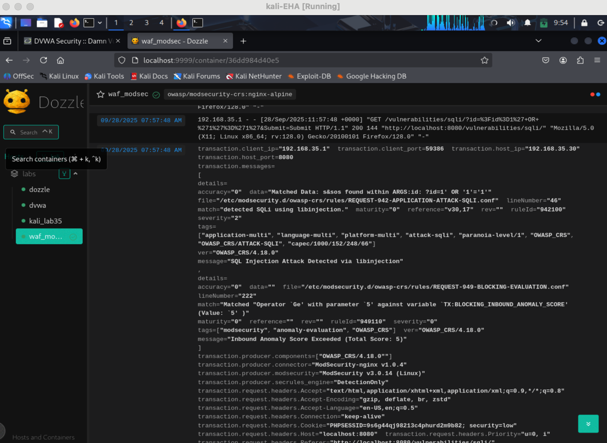

---

### XSS DOM (Detection Mode)

**Attack payload injected in the URL:**

```
<script>alert(document.cookie)</script>
```

The attack succeeds. A browser alert pops up displaying the session cookie, which can be used for session hijacking:

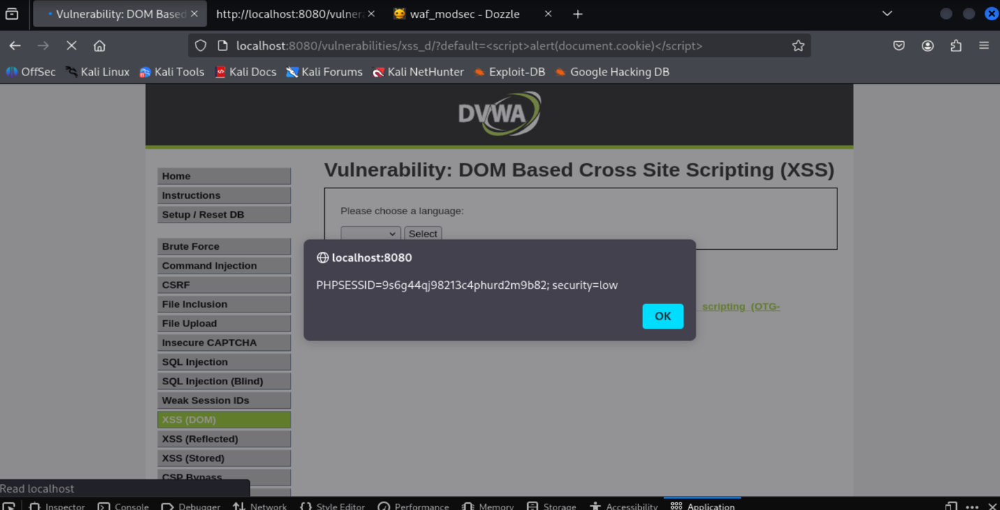

The Dozzle log confirms the detection with the payload in the `data` field:

```
tags=["attack-xss", "paranoia-level/1"]
message="NoScript XSS InjectionChecker: HTML Injection"
data="Matched Data: <script> found within REQUEST_HEADERS:Referer"
```

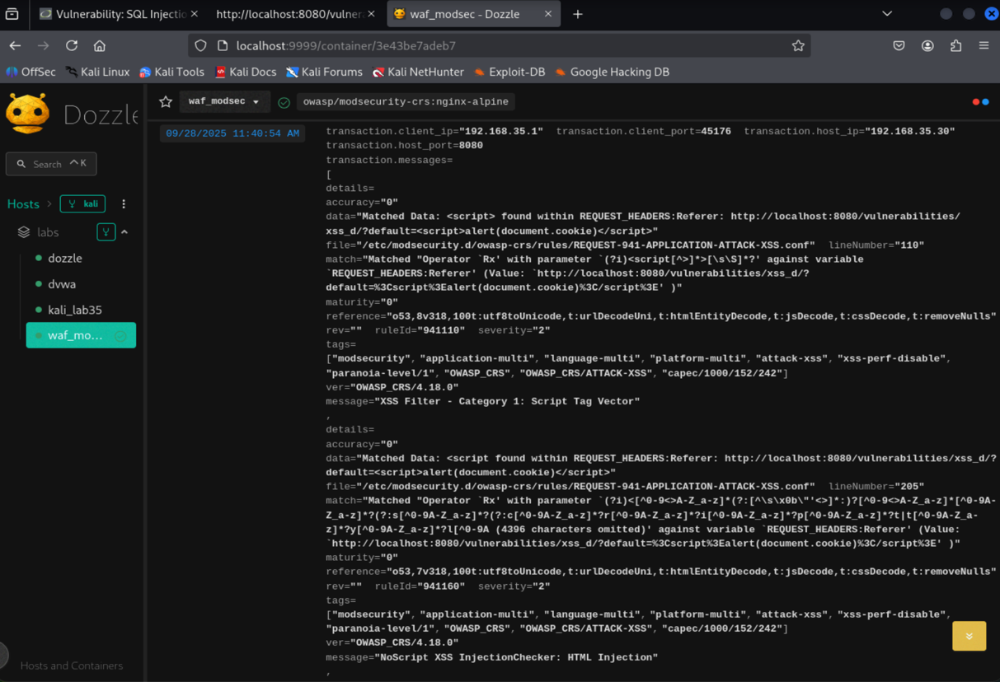

---

### Command Injection (Detection Mode)

**Attack payload injected in the ping input field:**

```
localhost ; cat /etc/passwd
```

The attack succeeds. The full `/etc/passwd` file is displayed on the web page:

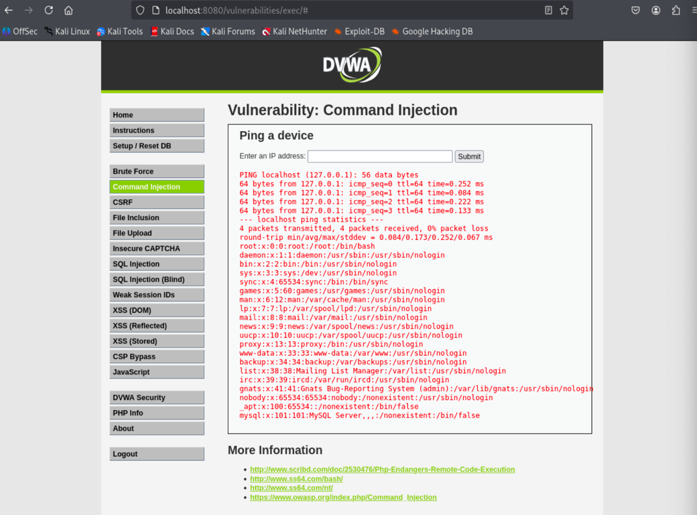

The Dozzle log confirms the detection, including the exact command used (visible in the `data` field):

```
tags=["attack-rce", "language-shell", "platform-unix", "paranoia-level/1"]
```

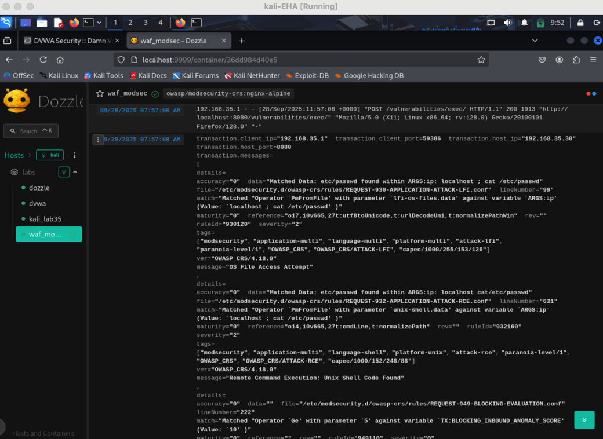

---

## Attacks in Blocking Mode (On)

In this mode the WAF actively blocks requests it identifies as malicious. All three attacks return a **403 Forbidden** response from nginx, and no data reaches the attacker. The application backend required no changes.

---

### SQL Injection (Blocking Mode)

The same SQLi payload now returns:

```
ModSecurity: Access denied with code 403
```

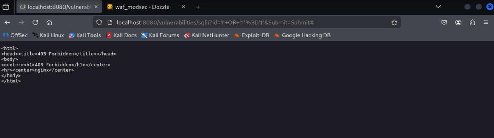

The Dozzle log still captures and classifies the attempt, now adding the block action:

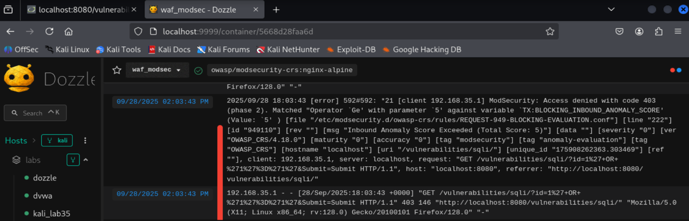

---

### XSS DOM (Blocking Mode)

The same XSS payload in the URL now returns:

```
ModSecurity: Access denied with code 403
```

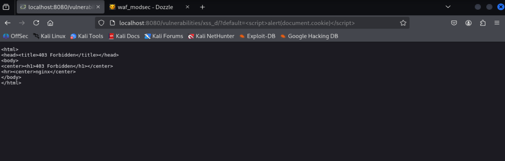

Dozzle log confirming the block:

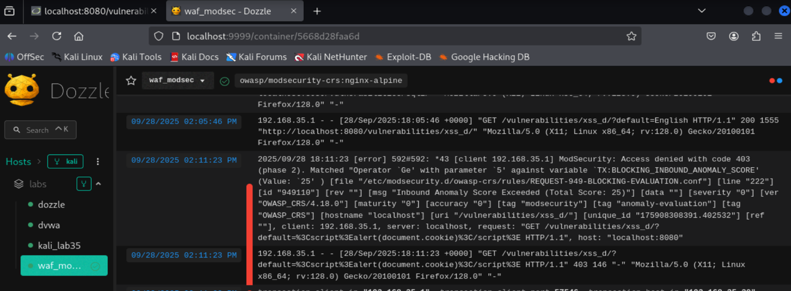

---

### Command Injection (Blocking Mode)

The same command injection payload now returns:

```
ModSecurity: Access denied with code 403
```

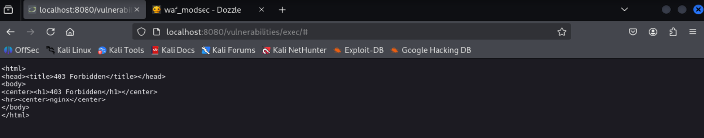

Dozzle log confirming the block:

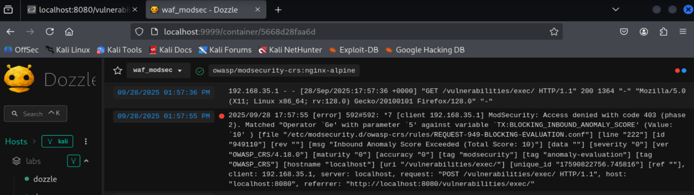

---

## NIST IR Framework

### Detection

SQLi, XSS DOM, and Command Injection attacks were detected by ModSecurity in DetectionOnly mode. Logs in Dozzle captured the client IP, port, attack tags, classification, and the exact payload used. Detection is immediate and requires no manual review to trigger.

### Containment

Switching the WAF to `On` mode immediately contained all three attack types with zero changes to the application backend. Containment is near-instant.

### Eradication

Recommended: fix the application backend with input sanitization, parameterized queries, and proper output escaping. Update the ModSecurity ruleset (OWASP CRS) regularly to keep detection signatures current.

### Recovery

Keep the WAF active in `On` mode. Preserve all logs for audit purposes. Integrate Dozzle output with a centralized SIEM for persistent log storage and alerting.

### Lessons Learned

Without backend input controls the application remains fundamentally vulnerable, even with the WAF active. A WAF bypass (malformed payloads, encoding tricks, protocol-level evasion) could still expose the application. The WAF should act as a **second line of defense**, not the first and only one.

---

## Recommendations

### Application Hardening

Apply input validation and sanitization in the backend, use parameterized queries for all database interactions, and implement proper output escaping to eliminate the root cause of SQLi, XSS, and Command Injection.

### WAF Fine-tuning

Increase the paranoia level on ModSecurity rules to catch more evasive variants. Tune false positives to avoid blocking legitimate traffic. Monitor logs continuously.

### Continuous Monitoring

Integrate Dozzle logs into a centralized log management or SIEM platform. Set up alerts for high-severity attack tags.

### Developer Training

Reinforce secure development practices across the team. Regularly validate security controls using pentesting tools before deploying to production.

---

## 80/20 Action Plan

| Action | Risk Addressed | Impact | Ease | Priority |
|--------|---------------|--------|------|----------|
| Keep ModSecurity in `On` mode and update ruleset | All web attacks against the application | High | High | **High** |
| Implement backend input validation (sanitization, parameterized queries) | SQLi, Command Injection, XSS at the root cause level | High | Medium | **Medium** |
| Integrate and monitor logs centrally with alerting | Delayed detection, lack of visibility into ongoing attacks | Medium | High | **Low** |

---

## Conclusion

Testing confirms that DVWA at low security is fully exploitable via SQLi, XSS DOM, and Command Injection. In DetectionOnly mode the WAF captures and classifies all attacks in detail while allowing them through. In On mode all three attacks are blocked immediately at the network layer with no backend changes required.

Without fixing the backend the vulnerabilities persist and remain exploitable if the WAF is bypassed or misconfigured. A WAF provides critical defense-in-depth but is not a substitute for secure application development.
